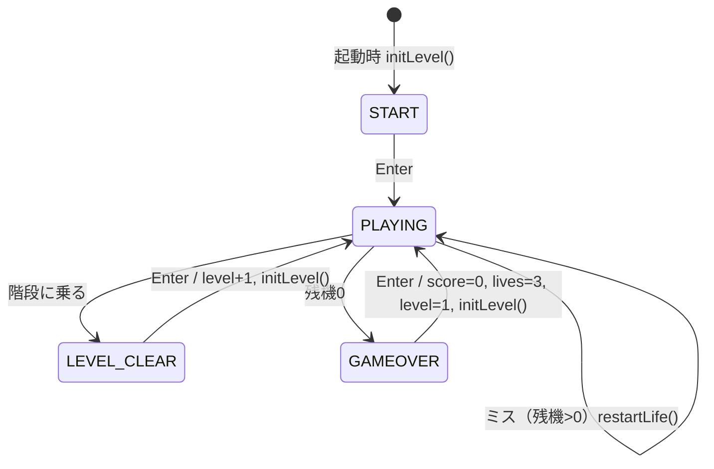
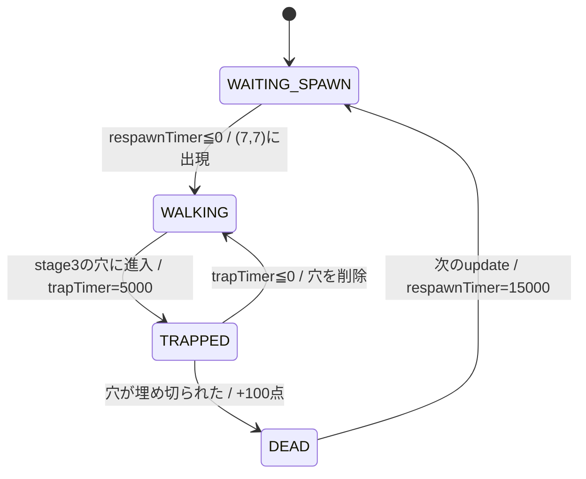
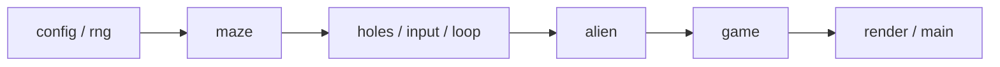
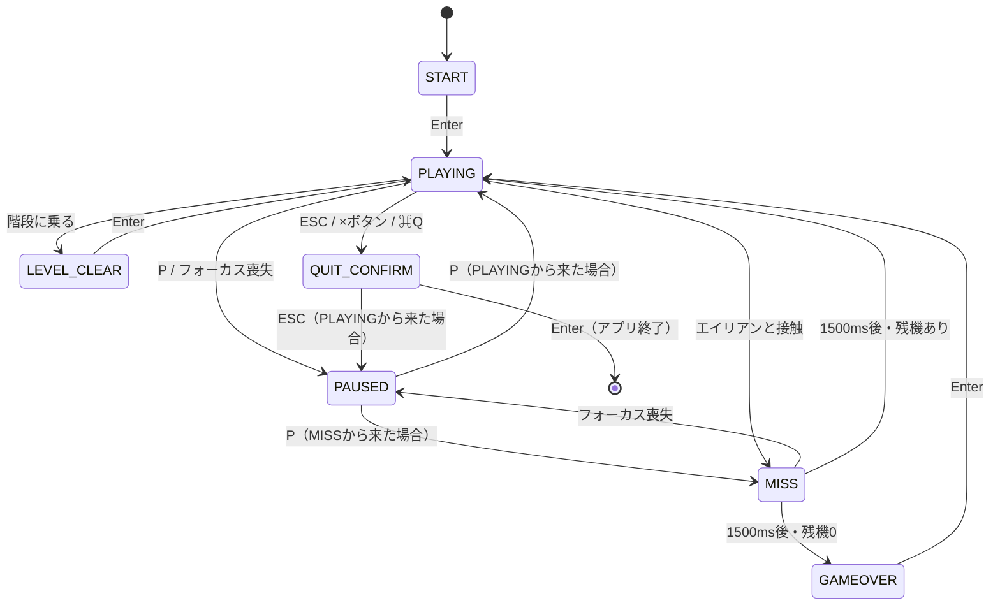

# 埋蔵金坑道 仕様書（HTML版ソース解析）

最終更新：2026年9月26日

## 1. 概要

「埋蔵金坑道」は、15×15マスの迷路で金塊をすべて集め、中央に出現する階段から次の坑道へ進む、平安京エイリアン型のアクションゲームです。敵（エイリアン）は穴を掘って落とし、埋めて倒します。

本仕様書は単一HTMLファイル（`code_artifact__3_.html`、約757行、Canvas 2D + JavaScript。リポジトリでは docs/original/maizokin-kodo.html）のソースコードのみから再構成したものです。記述はすべて現行コードの実際の挙動に基づき、バグと思われる挙動も「現状の挙動」として記載したうえで、13章で扱いを整理しています。

**優先順位**：2〜12章は原作の挙動、14〜17章はデスクトップ版で追加・変更する仕様です。両者が食い違う場合は14〜17章を優先します。13章の各項目の採否は13.1の「採否」列に従います。

- ゲームの目的：各坑道（レベル）の金塊を全回収 → 中央 (7,7) に階段出現 → 階段に乗るとレベルクリア
- 敵への対抗手段：前方マスに穴を掘る（3段階）→ エイリアンが深さ3の穴に入ると捕獲 → 穴を埋め切ると撃破
- 失敗条件：歩行中のエイリアンと同じマスに重なると残機−1。残機0でゲームオーバー
- エンディングなし（レベルは無限に続く）。ハイスコア保存なし（デスクトップ版では保存・表示する。16.10）
- 音声なし（コード中にサウンド処理は一切存在しない）

## 2. 定数一覧

時間の単位はすべてミリ秒（ms）です。移植時はこの表を設定ファイル／定数モジュールに集約することを推奨します。

| 名前（元コード） | 値 | 意味 |
| --- | --- | --- |
| `COLS` / `ROWS` | 15 / 15 | グリッドのマス数 |
| `TILE_SIZE` | 40 px | 1マスの描画サイズ |
| キャンバス | 600 × 640 px | 上40pxがUI帯、下600pxが盤面 |
| プレイヤー初期位置 | (7, 13) | x=列, y=行。ミス後もここに戻る |
| ポータル／階段位置 | (7, 7) | 盤面中央。エイリアン出現点でもある |
| `moveIntervalThreshold` | 180 | プレイヤー移動の連続入力間隔 |
| `turnCooldown` | 150 | 向き変更直後の移動禁止時間 |
| `actionIntervalThreshold` | 200 | 掘る／埋めるの連続入力間隔 |
| エイリアン `moveInterval` | 450 | エイリアンが1マス進む間隔。原作は全レベル共通。デスクトップ版はレベルで短くなる（16.17） |
| 捕獲時間 `trapTimer` | 5000 | 穴に落ちてから自力脱出するまで |
| 再出現待ち（撃破後） | 15000 | 撃破から再出現まで |
| 初回出現遅延 | (i+1) × 1000 | i番目（0始まり）のエイリアン |
| ポータル表示 | 出現前1000 ＋ 出現後1000 | `portalTimer` |
| 穴の最大深さ | 3 | stage 1〜3 |
| 初期残機 `lives` | 3 | エクステンドなし |
| エイリアン数 | 2 + level | 原作は上限なし。デスクトップ版は最大5体（13.1 #4） |
| 金塊数 | 5 + level × 2 | 配置できる通路マス数が上限（13.1 #3） |
| `hiScore` | 5000 | 原作は宣言のみで未使用。デスクトップ版ではハイスコアの初期値に使う（16.10） |
| 歩行アニメ切替 | 150 | 2フレーム交互 |
| 表示倍率（デスクトップ版） | 1.5 | 600×640 を 900×960 で表示（16.4） |
| 固定タイムステップ（デスクトップ版） | 1000/60 ≒ 16.7 | ロジック更新の単位（14.3） |
| 1フレームの最大ステップ数（デスクトップ版） | 5 | 超えた分の経過時間は切り捨てる（14.3） |
| ミス演出時間（デスクトップ版） | 1500 | MISS 状態の長さ（16.5） |
| 点滅間隔（デスクトップ版） | 100 | ミス演出中のプレイヤーの表示・非表示の切り替え |
| 赤フラッシュ（デスクトップ版） | 300 | ミス演出開始時、不透明度0.35から0まで |

## 3. 画面構成・座標系

論理解像度は 600×640 px 固定で、上端40pxがステータス帯、その下が 600×600 px の盤面です。

- グリッド座標：`(x, y)`、x=列（0〜14、右が正）、y=行（0〜14、下が正）。配列は `grid[y][x]`
- マス→画面座標：左上 = `(x*40, y*40 + 40)`、中心 = `(x*40 + 20, y*40 + 20 + 40)`
- 外周（x=0, x=14, y=0, y=14）は常に壁
- すべてのオブジェクト（プレイヤー、エイリアン、金塊、穴、階段）はマス単位で存在し、マス間の補間移動はない（瞬間移動で1マスずつ進む）

ステータス帯（y=28 がベースライン、太字20px、色 `#FFFF00`）：

| 位置 | 表示 | 揃え |
| --- | --- | --- |
| x=20 | `スコア: {score}` | 左 |
| x=300 | `坑道: {level}` | 中央 |
| x=580 | `残機: {lives}` | 右 |

デスクトップ版ではハイスコアを加えた4項目になります（16.10）。

HTML側の装飾（移植時は任意）：ページ背景 `#050510`、キャンバスを4pxの緑枠（`#00FF00`、角丸8px、緑のグロー）で囲み、下に「Z: 掘る  X: 埋める  矢印: 移動」の操作説明テキスト（16px、`#00FF00`）。キャンバスは `image-rendering: pixelated`。

## 4. ゲーム状態遷移

状態は `START` / `PLAYING` / `LEVEL_CLEAR` / `GAMEOVER` の4つで、PLAYING 以外の遷移はすべて Enter キーで行います。



- 起動時：level=1 で `initLevel()` を実行し、迷路と金塊を生成した状態で START 画面を表示する（背景に盤面が透けて見える）
- START / LEVEL\_CLEAR / GAMEOVER 中は `update()` を呼ばない。描画のみ継続（ポータルやエイリアンの揺れなど時間依存アニメは動くが、ゲーム内タイマーは止まる）
- GAMEOVER から Enter でタイトルに戻らず、直接 level 1 の新規プレイを開始する
- LEVEL\_CLEAR 時の盤面はクリア瞬間のまま停止表示される

各状態のオーバーレイ（全画面 `rgba(0,0,0,0.7)` を重ね、中央揃え）：

| 状態 | 1行目（太字40px） | 2行目（24px, `#FFFF00`） | 3行目（16px, `#FFFFFF`） |
| --- | --- | --- | --- |
| START | 「埋蔵金坑道」 `#00FF00`, y=290 | 「ENTERキーを押してスタート」 y=340 | 「Z: 掘る  X: 埋める  矢印: 移動」 y=380 |
| GAMEOVER | 「ゲームオーバー」 `#FF0000`, y=310 | 「ENTERキーを押してリトライ」 y=360 | なし |
| LEVEL\_CLEAR | 「次の坑道へ下降中...」 `#00FF00`, y=310 | 「ENTERキーで次の坑道へ」 y=360 | なし |

y座標はキャンバス全体（640px）基準のベースラインです。

デスクトップ版で追加する状態（PAUSED、MISS、QUIT\_CONFIRM）は16章を参照してください。

## 5. 入力とプレイヤー操作

プレイヤーは押しっぱなしで180msごとに1マス進み、Z/X を押している間は移動せず前方1マスに対して掘る／埋めるを200msごとに繰り返します。

### 5.1 キー割り当て

| キー | 機能 | 備考 |
| --- | --- | --- |
| ↑ ↓ ← → | 移動・向き変更 | 同時押し時の優先順位は 上 > 下 > 左 > 右 |
| Z（大文字小文字不問） | 掘る | Z と X の同時押しは Z が優先 |
| X（大文字小文字不問） | 埋める |  |
| Enter | 開始／次レベル／リトライ／終了の確定 | PLAYING・PAUSED・MISS 中は無効。終了の確定は QUIT\_CONFIRM のみ（16.3） |
| P（デスクトップ版） | 一時停止／再開 | 16.2 |
| ESC（デスクトップ版） | 途中終了の確認／取り消し | 16.3 |
| F（デスクトップ版） | CRT エフェクトのオン・オフ | どの状態でも有効（16.15） |

- キー状態は「押下中フラグ」の辞書で管理（keydown で true、keyup で false）
- 原作では keydown の記録は PLAYING 中のみ、keyup は常に記録する。デスクトップ版ではこの制限を設けず、16.7 の入力リセット（押し直すまで無効）で代替する
- 原作では状態遷移時にフラグはクリアされない。デスクトップ版は16.7に従ってリセットする

### 5.2 プレイヤーの状態

| 項目 | 初期値 | 意味 |
| --- | --- | --- |
| `x`, `y` | 7, 13 | グリッド位置 |
| `dir` | UP | 論理的な向き（掘る／埋める対象の方向）。4方向 |
| `faceDir` | RIGHT | 見た目の左右（スプライト反転用）。LEFT/RIGHT のみ |
| `turnCooldown` | 0 | 向き変更後の移動禁止残り時間 |
| `isMoving` | false | 歩行アニメを再生するか |

上下を向いても見た目は変わりません。`faceDir` は左右キー入力時にのみ更新されます（掘る／埋める中の方向入力でも更新される）。

### 5.3 毎フレームの処理手順（`handleInput(dt)`）

1. PLAYING 以外なら何もしない
2. 方向入力 `inputDir` を優先順位で1つ決定。`isMoving = (inputDir があるか)`
3. `inputDir` が LEFT/RIGHT なら `faceDir` を更新
4. `moveCooldown`、`actionCooldown`、`turnCooldown` をそれぞれ正の場合のみ dt 減算
5. **Z または X が押されている場合（アクション優先）**
   1. `inputDir` があり `dir` と異なれば `dir = inputDir`（クールダウンなし、即時）
   2. `actionCooldown <= 0` なら、前方マス（`dir` 方向に1マス）を対象にする。盤面内かつ通路（`grid==0`）の場合のみ：
      - 掘る：穴がなければ stage 1 を新規作成、stage < 3 なら +1、stage 3 なら変化なし。いずれも `actionCooldown = 200`
      - 埋める：穴があれば stage −1、0以下になったら穴を削除し `actionCooldown = 200`。穴がなければ何もせずクールダウンも設定しない
   3. 対象が壁・盤面外なら何もしない（クールダウンなし）
   4. `isMoving = false` にして終了（このフレームは移動しない）
6. **方向入力のみの場合**
   1. `dir` と異なる方向なら：`dir = inputDir`、`turnCooldown = 150`、`moveCooldown = 180` にして終了（このフレームは移動しない）
   2. `moveCooldown <= 0` かつ `turnCooldown <= 0` なら、進行先が盤面内・通路・穴なしの場合に1マス移動し `moveCooldown = 180`。進めない場合はクールダウンを設定しない
7. **方向入力なしの場合**：`moveCooldown = 0`

### 5.4 操作感として現れる挙動

- 向いている方向をタップすると即座に1マス進む（キーを離すと `moveCooldown` が0に戻るため）
- 違う方向をタップすると向きが変わるだけで進まない。180ms以上押し続けると進み始める
- プレイヤーは深さに関係なく穴のあるマス（stage 1〜3）に入れない。壁と同様に扱う
- プレイヤーは金塊・階段・ポータル（7,7）・エイリアンのいるマスにも穴を掘れる
- 移動の瞬間に補間はなく、次のマスへ即座に描画位置が移る

## 6. 迷路生成アルゴリズム

迷路は「穴掘り法で完全迷路を作る → 行き止まりがなくなるまで壁を壊す」の2段階で、レベルごとにランダム生成されます（シード指定なし）。

### 6.1 手順（`generateLoopMaze()`）

1. 15×15 をすべて壁（1）で初期化
2. **穴掘り法（再帰的バックトラック）**：`carve(1, 1)` から開始
   - 現在マスを訪問済み・通路（0）にする
   - 4方向の2マス先 `(0,-2) (0,2) (-2,0) (2,0)` をランダム順に並べる（元コードは `sort(() => Math.random() - 0.5)`。均一なシャッフルではないが、移植では Fisher–Yates で問題ない）
   - 2マス先が `0 < nx < 14` かつ `0 < ny < 14` で未訪問なら、間のマスを通路にして再帰
   - 結果、奇数座標 (1,3,5,…,13) のマスはすべて通路になる。プレイヤー初期位置 (7,13) と中央 (7,7) は必ず通路
3. **行き止まり除去**：以下を「行き止まりが1つも見つからない1周」まで繰り返す
   - 内側マス（1〜13）を y 外側・x 内側のループで走査
   - 通路マスで、上下左右のうち壁が3つ以上なら行き止まり
   - その壁のうち内側（外周以外）にあるものからランダムに1つ選んで通路にする
   - 1周のなかで即座に書き換えるため、同じ周の後続マスの判定に影響する
4. 外周（x=0, x=14, y=0, y=14）をすべて壁に戻す（念のための処理。実際には外周は掘られない）
5. 呼び出し元の `initLevel()` で `grid[7][7] = 0` を再設定（こちらも常に通路なので実質的に冗長）
6. **デスクトップ版で追加：1か所でしかつながっていない区画をなくす**。取り除くと通路が分断される通路マス（切断点）が見つからなくなるまで、次を繰り返す
   - 切断点を1つ見つけ（左上から順）、それを除いて分かれた区画のうち最も小さいものを選ぶ
   - その区画と外側（切断点を除く）を直接隔てている「通路と通路の間の壁」（片方の座標だけが偶数のマス）から、乱数で1つ選んで通路にする
   - 入口が1つしかない区画に入ると、お化けに入口をふさがれて逃げ道がなくなるため。壊す壁は平均で1枚ほどで、迷路の見た目はほとんど変わらない
   - 柱（偶数×偶数）は壊さない。候補がない場合や、繰り返しが200回に達した場合は打ち切る（実際には起きない）

### 6.2 生成される迷路の性質

- すべての通路マスが2方向以上に接続された「ループ迷路」になり、袋小路が存在しない
- 通路は連結している（穴掘り法の全域木に壁除去を加えるだけのため）
- デスクトップ版では、どの通路マスを取り除いても通路が分断されない（手順6）。どのマスからどのマスへも、重ならない道が2本以上ある
- 偶数×偶数座標（例 (2,2)）は常に壁のまま残る柱になる

## 7. 穴（掘る・埋める）

穴は通路マスに1つだけ存在でき、深さ stage 1〜3 を持ちます。エイリアンを捕獲できるのは stage 3 の穴だけです。

- データ構造：`holes` は `"x,y"` 文字列をキーとする辞書、値は `{ stage: 1|2|3 }`。stage 0 は存在しない（0 になった時点で削除）
- 掘る：Z を1回（200ms）ごとに stage +1。3回で最大深さに達する
- 埋める：X を1回ごとに stage −1。stage 1 の穴を埋めると穴が消える
- 穴は時間経過では消えない。消えるのは「埋め切る」「捕獲中のエイリアンが脱出する」「捕獲中のエイリアンが撃破される」「レベル開始（`initLevel`）」のときのみ
- ミス（`restartLife`）では穴はリセットされない

穴の種類ごとの影響：

| 対象 | stage 1〜2 | stage 3 |
| --- | --- | --- |
| プレイヤー | 進入不可 | 進入不可 |
| 歩行中のエイリアン | 素通り（穴は残る） | 進入した時点で捕獲（TRAPPED） |
| 金塊・階段 | 同じマスに共存可。プレイヤーが入れなくなるので、埋めるまで取得・到達不能 | 同左 |

- エイリアンの捕獲判定は「エイリアンが移動してそのマスに入った瞬間」のみ。エイリアンが立っているマスを後から stage 3 まで掘っても捕獲されない
- 撃破条件：捕獲中のエイリアンがいるマスの穴を、X で stage 0 まで埋め切る（stage 3 からなら X 押しっぱなしで3回＝最短約400ms）
- 5000ms 以内に埋め切れないとエイリアンは脱出し、その穴は削除される（深さ3の穴が消えるので掘り直しが必要）

## 8. エイリアン

エイリアンは中央 (7,7) から時間差で出現し、450msごとに1マス移動します。プレイヤーと一直線上で壁に遮られていなければ追跡し、それ以外はランダムに歩きます。

### 8.1 生成

- ミスのたび・レベル開始のたびに全エイリアンを作り直す（`restartLife()`）
- 数：`2 + level`（デスクトップ版は最大5体。13.1 #4）。i 番目（0始まり）の初回出現遅延は `(i+1) × 1000` ms
- 色：`#FF3333`（赤）, `#3388FF`（青）, `#FFFF33`（黄）, `#33FF33`（緑）, `#CC33FF`（紫）を i % 5 で循環
- 全員 (7,7) に生成され、状態 WAITING\_SPAWN で待機

### 8.2 状態とタイマー

| フィールド | 初期値 | 用途 |
| --- | --- | --- |
| `state` | WAITING\_SPAWN（遅延0なら WALKING） | 下図参照 |
| `respawnTimer` | 初回出現遅延 | 出現までの残り時間 |
| `portalTimer` | 1000 | 出現後のポータル表示残り時間 |
| `trapTimer` | 0 | 捕獲状態の残り時間 |
| `moveTimer` / `moveInterval` | 0 / 450 | 移動周期 |
| `dir` | ランダム4方向 | 前回の移動方向（逆走防止に使う） |



### 8.3 状態ごとの `update(dt)`

1. **WAITING\_SPAWN**：`respawnTimer -= dt`。0以下になったら位置を (7,7)、状態 WALKING、`trapTimer=0`、`portalTimer=1000`、`dir` をランダムに再設定。このフレームは移動しない
2. 上記以外なら `portalTimer > 0` の間 `portalTimer -= dt`
3. **DEAD**：状態を WAITING\_SPAWN、`respawnTimer=15000`、`portalTimer=1000` にして終了（DEAD は1フレームだけの遷移状態）
4. **TRAPPED**：`trapTimer -= dt`。先に「自マスの穴が存在しない」を判定し、該当すれば DEAD・スコア+100・穴削除。そうでなく `trapTimer <= 0` なら WALKING に戻り穴を削除。TRAPPED 中は移動しない
5. **WALKING**：`moveTimer += dt`。450 以上になったら `moveTimer = 0`（余剰は捨てる）にして `decideMove()`

### 8.4 移動AI（`decideMove()`）

1. **追跡方向の判定**：プレイヤーと同じ列（x一致）または同じ行（y一致）にいて、両者の間（両端を除く）のマスに壁がなければ、プレイヤー方向を `targetDir` とする。穴・他のエイリアンは視線を遮らない。同じマスにいる場合は x一致側の判定で targetDir=UP になる
2. **候補方向**：上下左右のうち、隣が盤面内かつ通路のものを `validDirs` とする。穴の有無、他エイリアンの位置は考慮しない
3. **方向決定**：
   - `targetDir` が `validDirs` にあればそれを選ぶ
   - なければ、`validDirs` から現在の `dir` の逆方向を除いた中から一様ランダム。除いた結果が空なら（行き止まり）`validDirs` から一様ランダム
4. 選んだ方向に1マス移動し `dir` を更新
5. 移動先に stage 3 の穴があれば TRAPPED、`trapTimer=5000`

補足：

- エイリアン同士は重なれる（衝突判定なし）
- 移動速度は原作ではレベルに関係なく一定（450ms/マス）。デスクトップ版はレベルで速くなる（16.17）
- 階段・金塊には干渉しない

## 9. 金塊・階段・レベル進行

各レベルの金塊は `5 + level × 2` 個で、すべて回収すると (7,7) に階段が出現し、階段に乗るとレベルクリアです。

### 9.1 レベル開始（`initLevel()`）の処理順

1. 迷路生成（6章）、`grid[7][7] = 0`
2. `restartLife()`：プレイヤー位置・向きのリセットとエイリアン再生成
3. `holes` を空に、`stairs = null`
4. 金塊を配置：ランダムなマスを引き、「通路」「(7,13) でない」「(7,7) でない」「既存の金塊と重ならない」を満たすまで再抽選。規定数に達するまで繰り返す

| level | 金塊 | エイリアン（原作） | エイリアン（デスクトップ版） | 移動間隔（デスクトップ版、16.17） |
| --- | --- | --- | --- | --- |
| 1 | 7 | 3 | 3 | 450ms |
| 2 | 9 | 4 | 4 | 430ms |
| 3 | 11 | 5 | 5 | 410ms |
| 5 | 15 | 7 | 5 | 370ms |
| 10 | 25 | 12 | 5 | 270ms |

### 9.2 金塊

- データ：`{ x, y, collected }` の配列。取得済みは描画せず配列に残す
- 取得：プレイヤーが金塊のマスに入ると `collected = true`、スコア +200
- エイリアンは金塊を取らない。ミスしても取得済みの金塊は戻らない

### 9.3 階段とクリア

- 全金塊が取得済みになった最初のフレームで `stairs = {x:7, y:7}` を設定し、スコア +500（1レベル1回）
- 階段は (7,7) 固定＝エイリアンの出現ポータルと同じマス。出現後もエイリアンは同じ場所から湧き続ける
- プレイヤーが階段マスに乗ると状態 LEVEL\_CLEAR、スコア +1000
- Enter で `level += 1` して `initLevel()`。スコアと残機は引き継ぐ

## 10. 当たり判定・残機・スコア

当たり判定は「WALKING 状態のエイリアンとプレイヤーが同じマスにいるか」だけで、各エイリアンの `update` 直後に判定します。

### 10.1 ミス判定

- 条件：`alien.state === 'WALKING'` かつ座標がプレイヤーと一致
- TRAPPED・WAITING\_SPAWN・DEAD のエイリアンとは接触しても安全
- すれ違い（同一フレームで互いのマスを入れ替わる）は検出しない（原作。デスクトップ版は検出する。16.14）
- ミス時：`lives -= 1`。0以下なら GAMEOVER、そうでなければ `restartLife()`。いずれの場合もそのフレームの残り処理（残りのエイリアン更新、金塊取得、階段判定）を打ち切る

`restartLife()` の効果：

| 対象 | 扱い |
| --- | --- |
| プレイヤー | (7,13)、dir=UP、faceDir=RIGHT、turnCooldown=0、isMoving=false |
| エイリアン | 全員作り直し（1000ms 間隔で再出現） |
| 迷路・穴・金塊・階段 | そのまま維持 |
| `moveCooldown`・`actionCooldown`（グローバル） | 原作はリセットされない。デスクトップ版はリセットする（16.7） |
| ミス演出・無敵時間 | 原作はなし（即座に再開）。デスクトップ版は16.5のミス演出を挟む |

### 10.2 スコア

| イベント | 加点 |
| --- | --- |
| エイリアン撃破 | +100 |
| 金塊取得 | +200（1個ごと） |
| 全金塊回収（階段出現） | +500 |
| 階段到達（レベルクリア） | +1000 |

- スコアはゲームオーバー後のリトライで0に戻る
- `hiScore = 5000` という変数は宣言のみで、表示も更新もされない
- エクステンド（残機追加）はない

## 11. メインループと更新順序

ループは `requestAnimationFrame` による可変フレームレートで、前フレームからの経過時間 `dt`（ms）をそのまま全タイマーに渡します（上限クランプなし）。

1フレームの処理：

1. `dt = now − lastTime`、`lastTime = now`
2. 状態が PLAYING なら `update(dt)`
3. 状態に関係なく `draw(now)`（アニメーションは `now` の絶対時刻で計算）

`update(dt)` の内部順序（この順序が挙動を決めるため移植時も維持する）：

1. `handleInput(dt)`：プレイヤーの移動・掘る・埋める
2. エイリアンを配列順に1体ずつ：`alien.update(dt)` → 直後にミス判定。ミスならここで `update` を終了
3. 金塊取得判定（プレイヤー位置の未取得金塊）
4. 階段出現判定（全金塊取得済みかつ未出現）
5. 階段到達判定（階段があり、プレイヤーがその上）

順序から生じる細かい挙動：

- 最後の金塊を取ったフレームで階段が出現するが、プレイヤーは (7,7) にいないので同フレームのクリアは起きない（(7,7) には金塊を置かないため）
- エイリアンの撃破（穴を埋め切る）は `handleInput` で穴が消えた後、同じフレームのエイリアン更新で検出される
- 時間依存アニメ（ポータル回転、点滅、尻尾の揺れ、歩行アニメ）は状態が PLAYING でなくても動き続ける

## 12. 描画仕様

グラフィックは画像ファイルを使わず、すべてコードで描いた矩形・円・パス・ドット絵です。以下の座標は、特記なき限り各マスの中心を原点（盤面の描画は y 方向に +40 オフセット済み）とした px 値です。

### 12.1 描画順

1. キャンバス全体を `#000022` で塗りつぶす（これが通路の床色）
2. ステータス帯（3章）
3. 盤面原点を (0, 40) へ移動
4. ポータル → 壁 → 階段 → 穴 → 金塊 → プレイヤー → エイリアン
5. 原点を戻し、状態オーバーレイ（4章）

### 12.2 壁（マス左上原点、40×40）

3段のレンガ模様です。マス全体を `#003300` で塗り、レンガ本体・上端ハイライト・下端シャドウを重ねます。

| 段 | レンガ本体 `#00CC00`（x, y, 幅, 高さ） | ハイライト `#33FF33`（高さ2） | シャドウ `#006600`（高さ2） |
| --- | --- | --- | --- |
| 1段目 | (1,1,18,12), (21,1,18,12) | 各レンガの y=1 | 各レンガの y=11 |
| 2段目 | (1,14,8,12), (11,14,18,12), (31,14,8,12) | 各レンガの y=14 | 各レンガの y=24 |
| 3段目 | (1,27,18,12), (21,27,18,12) | 各レンガの y=27 | 各レンガの y=37 |

### 12.3 エイリアンのポータル（(7,7)）

- 表示条件：いずれかのエイリアンが「WAITING\_SPAWN かつ `respawnTimer ≦ 1000`」または「WALKING かつ `portalTimer > 0`」
- マス全体を `#110022` で塗る
- 中心で `now/500` ラジアン回転した後、π/4 ずつ回転しながら三角形 (0,0)-(8,16)-(-8,16) を8枚描く。色は `floor(now/150)` の偶奇で `#FF0000` / `#FF00FF` を交互（8枚とも同色）
- 中心に半径 `6 + sin(now/150) × 3` の円：塗り `#000000`、線 `#FFFFFF` 幅2

### 12.4 階段

- `#555555` の正方形 (-14,-14, 28,28)
- i = -10, -4, 2 の3段：`#888888` の (-12, i, 24, 4)、その直下に `#333333` の (-12, i+4, 24, 2)

### 12.5 穴

白（`#FFFFFF`）の円の輪郭、線幅4。半径は stage 1=6、stage 2=12、stage 3=16。塗りなし（床色が透ける）。デスクトップ版では、捕獲中のエイリアンがいるマスも円を描き、埋めるたびに小さくなるのが見えるようにする。そのマスの円はエイリアンの絵に隠れないよう、エイリアンの上に重ねる（16.16）。

### 12.6 金塊

中心で −π/8 ラジアン回転し、次の矩形を順に描画：

| 色 | 矩形（x, y, 幅, 高さ） | 役割 |
| --- | --- | --- |
| `#B8860B` | (-10, -4, 24, 14) | 影 |
| `#DAA520` | (-12, -6, 24, 14) | 本体 |
| `#FFDF00` | (-10, -4, 20, 10) | 上面 |
| `#FFFFFF` | (-8, -2, 14, 2) と (-8, -2, 2, 6) | 光沢（L字） |

### 12.7 プレイヤー（ドット絵）

14×16 ドットの2フレーム（原作。デスクトップ版は16.16の絵に置き換える）。1ドットを 2.4px 角（隙間防止に各辺 +0.5px して 2.9px で塗る）とし、マス中心に合わせて配置します（左上オフセット (-16.8, -19.2)）。`faceDir` が LEFT のときは中心を軸に左右反転。

- フレーム選択：`isMoving` が偽なら常に立ち。真なら `floor(now/150)` の偶数で立ち、奇数で歩き
- パレット：`B`=`#111111`（輪郭・目）、`Y`=`#FFCC00`（ヘルメット・服）、`F`=`#FFCC99`（肌）、`L`=`#2266CC`（青）、`W`=`#EEEEEE`（ツルハシの刃）、`S`=`#663C21`（ツルハシの柄）、`.`=透明

立ちフレーム（pStand）：

```
....BBBBBB....
...BYYYYYYB...
...BYYYYYYB...
..BBYYYYYYBB..
...BFFFFFFB...
...BFBFFBFB...
...BFFFFFFB...
...BFFFFFFB...
..BBLLYYLLBB..
.BWWBYYYYYBWBB
BSSWBYYYYYBWBB
BSSWBYYYYYBWBB
.BBWBYYYYBYB..
....BBYYBB....
....B....B....
...BB....BB...
```

歩きフレーム（pWalk、12行目以降が異なる）：

```
....BBBBBB....
...BYYYYYYB...
...BYYYYYYB...
..BBYYYYYYBB..
...BFFFFFFB...
...BFBFFBFB...
...BFFFFFFB...
...BFFFFFFB...
..BBLLYYLLBB..
.BWWBYYYYYBWBB
BSSWBYYYYYBWBB
BSSWBYYYYBYB..
.BBWBBYYBBB...
....B....B....
....B....BB...
...BB....BB...
```

### 12.8 エイリアン（おばけ型）

- WAITING\_SPAWN は描画しない（原作の図形。デスクトップ版は16.16の絵に置き換える）。TRAPPED は中心基準で横0.8倍・縦0.6倍に縮小して描く（穴に沈んだ表現）
- 本体（エイリアン固有色で塗りつぶし）：中心 (-2,-2) 半径13 の上半円（左端 (-15,-2) から上を通って右端 (11,-2) へ）→ 制御点 (11,10) の二次ベジェで尻尾先端 `(16 + sway, 16)` へ → 制御点 (4,18), (-10,16) の三次ベジェで (-15,6) へ → パスを閉じる。`sway = sin(now/200) × 2`
- 目：黒の楕円2つ。中心 (-6,-4) と (3,-4)、半径 横2・縦3.5
- 手：黒の線（幅1.5、端は丸）でU字の下半円2つ。中心 (-7,5) と (4,5)、半径1.5、角度0→π
- 向きによる反転やアニメーションフレームはない（尻尾の揺れのみ）

## 13. 既知の不具合・曖昧点と移植時の推奨

移植では、ゲーム性に関わる挙動（2〜12章）は維持し、下表の「推奨対応」で不具合だけを直す前提を推奨します。

### 13.1 不具合・潜在リスク

| # | 現状の挙動 | 影響 | 推奨対応 | 採否 |
| --- | --- | --- | --- | --- |
| 1 | START で Enter を押すと `requestAnimationFrame(gameLoop)` を追加で呼ぶため、ゲームループが2本並走する | 1フレームに update/draw が2回走る（2回目は dt≒0 なので実害は小さい）。CPU負荷が倍 | ループは1本のみ。状態遷移はループ内の分岐で扱う | 採用（14.3） |
| 2 | `dt` に上限がない | ウィンドウ非アクティブ後などに巨大な dt が入り、捕獲中エイリアンが即脱出、再出現タイマーが一気に進む | 固定タイムステップ＋1フレームの上限、フォーカス喪失時は一時停止 | 採用（14.3、16.2） |
| 3 | 金塊配置は条件を満たすまで無限に再抽選する | 金塊数が通路マス数を超えると無限ループ。level 45前後以降でハングし得る | 通路マスのリストをシャッフルして先頭から取る。配置できる数を超える分は置かない | 採用 |
| 4 | エイリアン数が `2 + level` で上限なし | 高レベルで盤面が埋まる | 上限（例 8〜10体）を検討 | 採用：最大5体 |
| 5 | エイリアン出現時、(7,7) にプレイヤーがいると即ミス | 出現直前のポータル表示中に中央に立つと理不尽に死ぬ | 維持するか、出現を1マス待たせるか | 採用：普段は原作どおり、階段がある間は出現しない（16.13） |
| 6 | (7,7) に穴があってもエイリアンはその上に出現し、捕獲されない | ポータル上の穴は罠として機能しない | 原作準拠で維持 | 維持 |
| 7 | すれ違いの衝突を検出しない | 同フレームで入れ替わると素通り | 維持、または移動前後の位置も比較 | 採用：入れ替わりも衝突とする（16.14） |
| 8 | 上下の向きが見た目に出ない | 掘る方向が分かりにくい | 前方マスのカーソル表示などを追加 | 採用：坑夫の絵を向きごとに描き分ける（16.16）。前方マスの枠表示（16.12）は廃止 |
| 9 | 状態遷移時にキー押下フラグ、`moveCooldown`、`actionCooldown` がリセットされない | 実害は小さい | 入力状態をクリア | 採用（16.7） |
| 10 | Enter のキーリピートを区別しない | 長押しで LEVEL\_CLEAR 画面が一瞬で飛ぶ可能性 | 押下エッジのみで遷移 | 採用（14.3） |
| 11 | `hiScore` 変数が未使用。WAITING\_SPAWN 内に何もしない `portalTimer` の再代入がある | なし | 何もしないコードは移植しない。ハイスコアは別途決める | 採用（ハイスコアは16.10） |
| 12 | 方向シャッフルが `sort(() => Math.random() - 0.5)` | わずかな偏り | Fisher–Yates で置換 | 採用 |

### 13.2 デスクトップ移植時の注意

- **日本語フォント**：元コードは Courier New 指定でブラウザのフォールバックにより日本語が表示されている。デスクトップ版では当面 macOS のシステムフォントを使う（16.6）
- **解像度**：表示倍率とドット絵の描き方は16.4に従う
- **ロジックと描画の分離**：update は dt とグリッド状態のみに依存させ、描画は状態を読むだけにする。乱数はシード指定可能にするとテストが書きやすい
- **原作にない操作**：一時停止（P）と途中終了（ESC）は元コードに存在しないため、16章で追加仕様として定義した
- **音声**：元コードにサウンドはない

## 14. 採用技術と実装方針

デスクトップ版は Tauri + PixiJS v8 + TypeScript（Vite）で実装し、ゲームロジックと描画を分離したうえで、2〜12章の挙動を再現します。

### 14.1 技術スタック

| 領域 | 採用 | 備考 |
| --- | --- | --- |
| デスクトップ化 | Tauri | Rust 側は雛形に、⌘Q 用のメニュー項目の置き換え（16.3）と、ハイスコア保存用の store プラグイン（16.10）を加える程度 |
| 描画 | PixiJS v8 | v7 以前の API（`beginFill` など）は使わない。`.rect().fill()` 形式で書く |
| エフェクト | pixi-filters | グロー・CRT などは後付けでオンオフできる作りにする |
| 言語・ビルド | TypeScript + Vite | `npm create tauri-app` の Vanilla TS テンプレートを起点にする |
| フォント | macOS のシステムフォント | `@font-face` は使わない。指定は16.6のとおり |

### 14.2 モジュール構成

| モジュール | 責務 | 依存 |
| --- | --- | --- |
| `core/config.ts` | 2章の定数をすべて集約 | なし |
| `core/rng.ts` | シード指定可能な乱数、Fisher–Yates シャッフル | なし |
| `core/maze.ts` | 迷路生成（6章） | config, rng |
| `core/holes.ts` | 穴の深さの管理（7章） | config |
| `core/alien.ts` | エイリアンの状態・タイマー・移動AI（8章） | config, rng, holes |
| `core/loop.ts` | 固定タイムステップの計算（14.3） | config |
| `core/input.ts` | キー押下フラグ、押下エッジ、入力リセット（5.1、16.7） | なし |
| `core/game.ts` | 状態遷移（4章・16章）、プレイヤー操作、金塊・階段・スコア・残機、ミス演出・一時停止・終了確認 | 上記すべて |
| `render/*.ts` | 壁・ポータル・階段・穴・金塊・プレイヤー・エイリアン・UI・オーバーレイ・ミス演出の描画（12章、16章） | game の状態を読むだけ |
| `platform.ts` | Tauri との連携：フォーカス変化、×ボタン、⌘Q のイベント受信とウィンドウ破棄（16.3） | @tauri-apps/api |
| `main.ts` | Pixi アプリ生成、ループ、キーイベントの受け渡し | すべて |

`core/` 配下は PixiJS・DOM・Tauri API を import せず、Vitest でロジック単体のテストが書ける状態に保ちます。

### 14.3 実装ルール

1. **論理解像度**：600×640 固定。Pixi のステージをこのサイズで組み、1.5倍（900×960）で表示する（16.4）
2. **ゲームループ**：Pixi の Ticker から経過時間を受け取り、1/60 秒の固定タイムステップでロジックを更新する。1フレームで消化するステップ数には上限（5ステップ＝約83ms分。超えた経過時間は切り捨て）を設ける（13章 #1・#2 の対策）。これにより各タイマーは最大1ステップ（約16.7ms）遅れて発火する（例：移動間隔180msは11ステップ＝約183ms）が、この誤差は許容する。テストでは dt を固定ステップ単位で与え、発火するステップ数で検証する
3. **描画方式**：オブジェクトは生成して使い回し、毎フレームは位置・表示・形状の更新のみ行う。壁はレベル開始時に1回描いてキャッシュする。時間依存のアニメ（ポータル、尻尾の揺れ、歩行アニメ）は12章の式どおりに毎フレーム更新する
4. **ドット絵**：坑夫とエイリアンは16.16のドット絵を、1ドット＝論理2pxで描く
5. **入力**：キー割り当ては5.1に P（一時停止）と ESC（途中終了）を加えたもの。Enter・P・ESC は押下エッジのみで遷移させ、キーリピートでは遷移しない（13章 #10）。ミス・レベル開始時のリセットは16.7のとおり
6. **一時停止**：P キーまたはウィンドウのフォーカス喪失で PAUSED にする。再開は P キーのみ（16.2）
7. **エフェクト**：16.15 のエフェクト（グロー、パーティクル、CRT、画面の揺れ、ポータルの波紋）を入れる。フィルターは描画レイヤー単位でかけ、CRT は F キーで切り替えられるようにする

### 14.4 未決事項

- なし（すべて決定済み）

### 14.5 モジュール間のインターフェース

`main.ts` がキーと Tauri のイベントを受け取り、固定ステップごとに `game.step()` を呼びます。ゲーム側からの要求（入力リセット、アプリ終了）は `step()` の戻り値のイベントで返します。

```ts
type Dir = 'UP' | 'DOWN' | 'LEFT' | 'RIGHT';

// input.ts が固定ステップごとに作るスナップショット
interface InputSnapshot {
  dir: Dir | null;  // 押下中の方向（優先順位適用済み）
  dig: boolean;     // Z 押下中
  fill: boolean;    // X 押下中
  enter: boolean;   // このステップで押された（押下エッジ）
  pause: boolean;   // 同上（P）
  escape: boolean;  // 同上（ESC）
}
// F キー（CRT の切り替え）はゲームの状態に関係しないため、
// input.ts の押下エッジを main.ts が直接受けて描画側と platform.ts に渡す

// game.step() が返すイベント
type GameEvent =
  // 外部への要求
  | { type: 'inputReset' }                    // input.ts に入力リセットを依頼（16.7）
  | { type: 'saveHiScore'; value: number }    // platform.ts にハイスコア保存を依頼（16.10）
  | { type: 'quit' }                          // platform.ts にウィンドウ破棄を依頼（16.3）
  // 描画側への通知（エフェクト用、16.15）
  | { type: 'goldCollected'; x: number; y: number }
  | { type: 'holeDug'; x: number; y: number }
  | { type: 'holeFilled'; x: number; y: number }
  | { type: 'alienKilled'; x: number; y: number; color: string }
  | { type: 'stairsAppeared' }
  | { type: 'miss' };

class Game {
  constructor(rng: Rng, initialHiScore: number);
  step(dtMs: number, input: InputSnapshot): GameEvent[];
  focusLost(): void;       // PLAYING・MISS 中なら PAUSED へ（16.2）
  closeRequested(): void;  // ×ボタン・⌘Q。QUIT_CONFIRM へ（16.3）
  // 描画用に状態を読み取り専用で公開する（state, score, hiScore, lives, level,
  // grid, holes, gold, aliens, stairs, player, missElapsedMs, newRecord など）
}
```

- `step()` は状態に関係なく毎ステップ呼ぶ。PAUSED・QUIT\_CONFIRM などではロジックを進めず、キー判定だけ行う
- 押下エッジ（Enter・P・ESC）は、次に作るスナップショットに1回だけ載せて消費する。そのフレームでステップが0回なら、次のステップまで持ち越す
- 終了確定のステップでは `saveHiScore`（必要な場合）と `quit` をこの順で返す
- 描画用の時間（ポータルの回転、尻尾の揺れ、歩行アニメ）はロジックとは別に、Ticker の実時間の累計を使う。一時停止中も進む
- `platform.ts` の役割：起動時にハイスコアを読み込んで `Game` に渡す。Tauri のフォーカス変化で `focusLost()`、`onCloseRequested`（`preventDefault()` 済み）と⌘Q メニューのイベントで `closeRequested()` を呼ぶ。`saveHiScore` で保存し、`quit` では保存の完了を待ってから `destroy()` でウィンドウを破棄する

## 15. 開発プロセス

実装は Vitest による単体テストを使ったテスト駆動開発（TDD）で進め、ロジック層のカバレッジ90%以上を目標とします（必須ではない）。

### 15.1 ツール

| 用途 | 採用 | コマンド |
| --- | --- | --- |
| テストランナー | Vitest | `npm test`（1回実行）、`npm run test:watch`（監視） |
| カバレッジ | @vitest/coverage-v8 | `npm run coverage`（テキストとHTMLで出力） |
| 型チェック | TypeScript | `npm run build` に含める |

### 15.2 進め方

各モジュールを Red → Green → Refactor の順で作ります。

1. **Red**：仕様書の該当章から期待する挙動をテストに書き、失敗することを確認する
2. **Green**：テストが通る最小限の実装を書く
3. **Refactor**：テストが通ったまま、重複や分かりにくい箇所を整理する

モジュールは依存の少ない順に進めます。



render と main はテスト対象外とし、ロジック層が完成してから画面で確認しながら作ります。

### 15.3 モジュールとテスト観点

モジュール構成は14.2、モジュール間の取り決めは14.5のとおりです。テスト対象は `core/` 配下のモジュールです。

| モジュール | 主なテスト観点 | 仕様書 |
| --- | --- | --- |
| `rng.ts` | 同じシードで同じ乱数列になる、値が 0以上1未満、シャッフル結果が元配列の並べ替えになっている | 6章, 13章 #12 |
| `maze.ts` | 外周が壁、奇数座標がすべて通路、(7,13) と (7,7) が通路、袋小路がない、全通路が連結、1か所でしかつながっていない区画がない（切断点がない）、偶数×偶数が壁、シードで再現できる | 6章 |
| `holes.ts` | 掘ると stage 1→3 で上限、埋めると減って0で削除、穴のないマスを埋めても変化しない | 7章 |
| `input.ts` | 方向キーの優先順位、Z と X の同時押しで Z 優先、Enter・P・ESC は押下エッジのみでキーリピートを無視、リセット後は押し直すまで無効 | 5.1, 13章 #10 |
| `loop.ts` | 経過時間に応じたステップ数、端数の繰り越し、1フレームの上限でのクランプ | 14.3, 13章 #2 |
| `alien.ts` | 出現遅延とポータル表示時間、視線が通るときの追跡と壁による遮断、逆走回避と行き止まり時の例外、stage 3 で捕獲・1〜2は素通り、埋め切りで撃破と+100点、5秒で脱出して穴が消える、撃破後15秒で再出現、階段がある間は出現せずポータルも出ない（16.13）、レベルに応じた移動間隔（16.17） | 8章 |
| `game.ts` | Enter による状態遷移、移動・向き変更・クールダウン・穴で進めない、前方への掘る／埋める、金塊+200、全回収で階段と+500、階段でクリアと+1000、ミスで残機減少と再配置、残機0でゲームオーバー、リトライ時の初期化、一時停止、ミス演出（1500ms後の復帰とゲームオーバー）、終了確認、ハイスコアの更新と保存イベント（16.10）、更新順序、金塊数の上限、エイリアン数の上限（5体）、すれ違い（入れ替わり）の衝突、エフェクト用イベント（金塊取得・掘る・埋める・撃破・階段出現・ミス）が正しい位置で1回だけ返る | 4〜5章, 9〜11章, 13章 #3 |

### 15.4 カバレッジ

- 計測対象は `src/core/`（ロジック層）のみ。PixiJS・DOM・Tauri に依存する `src/render/`、`platform.ts`、`main.ts` と、Rust 側のコードは対象外とし、15.6 の手動確認で検証する
- 行・分岐・関数・命令の4指標で90%を目標とする。未達はテスト失敗にせず、警告を出すだけにする（Vitest の `thresholds` は設定しない）
- 警告の出し方：Vitest のカバレッジ出力に `json-summary` を加え、`scripts/check-coverage.mjs` が `coverage/coverage-summary.json` を読んで90%未満の指標を表示する。GitHub Actions 上では `::warning::` 形式で出してプルリクエストに注釈を付ける。終了コードは常に0とし、CI を失敗させない

```js
// scripts/check-coverage.mjs
import { readFileSync } from 'node:fs';

const TARGET = 90;
const { total } = JSON.parse(readFileSync('coverage/coverage-summary.json', 'utf8'));
for (const key of ['lines', 'branches', 'functions', 'statements']) {
  const pct = total[key].pct;
  if (pct < TARGET) {
    const msg = `coverage ${key}: ${pct}% (目標 ${TARGET}%)`;
    console.log(process.env.GITHUB_ACTIONS ? `::warning::${msg}` : `WARNING: ${msg}`);
  }
}
```

### 15.5 テストしやすくするための設計ルール

1. **乱数の注入**：迷路生成・金塊配置・エイリアンの方向決定は、シード指定できる乱数関数を引数で受け取る。本番では起動時とレベル開始時に `crypto.getRandomValues()` でシードを作り、開発ビルドではそのシードをコンソールに出力して、不具合を再現できるようにする
2. **時間は dt のみ**：ロジック層では `Date` や `performance.now()` を使わず、経過時間は引数の dt だけで扱う
3. **入力はスナップショット**：`game.step(dt, input)` に、14.5 の `InputSnapshot`（方向・掘る・埋める・Enter・P・ESC）を値として渡す。フォーカス喪失と終了要求は `focusLost()`・`closeRequested()` で伝える
4. **状態の直接設定**：テストで任意の迷路・プレイヤー位置・穴・エイリアン配置を用意できるよう、状態を公開するか設定用の関数を用意する

### 15.6 完了の条件

- [ ] すべての単体テストが通る
- [ ] 型チェックでエラーがない
- [ ] カバレッジレポートを出力し、目標値に届かない指標は警告の内容を確認した
- [ ] 画面で12章の描画（壁、ポータル、階段、穴、金塊、プレイヤー、エイリアン、オーバーレイ）、16.16のキャラクターの絵を目視確認した
- [ ] P で一時停止・再開でき、再開後は押しっぱなしのキーが効かない（16.2、16.7）
- [ ] プレイ中とミス演出中に別アプリへ切り替えると一時停止し、戻っても自動で再開しない（16.2）
- [ ] ESC・×ボタン・⌘Q のいずれでも終了確認が出て、Enter で終了、ESC で取り消せる（16.3）
- [ ] ミス時に1.5秒の点滅・赤フラッシュ・画面の揺れが出て、その後再開またはゲームオーバーになる（16.5、16.15）
- [ ] 900×960 のウィンドウが画面中央に表示され、サイズ変更できない（16.4）
- [ ] ハイスコアを更新して終了し、再起動しても表示が残っている（16.10）
- [ ] グロー・パーティクル・ポータルの波紋が16.15のとおり出て、60fps を保っている
- [ ] 初回起動で CRT がオン、F で切り替えられ、再起動後も設定が残っている（16.15）
- [ ] macOS の「視差効果を減らす」をオンにすると、画面の揺れと波紋が出ない（16.15）
- [ ] タグのプッシュで GitHub Actions が dmg を作り、リリースの下書きに添付される（17.8）
- [ ] ダウンロードした dmg からインストールし、Gatekeeper の許可手順で起動できる（16.8）

## 16. デスクトップ版の追加仕様

デスクトップ版では原作にない状態として一時停止（PAUSED）、ミス演出（MISS）、終了確認（QUIT\_CONFIRM）を追加し、フルHDの macOS 向けに 1.5倍表示・dmg 配布とします。

### 16.1 状態遷移（4章の拡張）



ESC・ウィンドウの×ボタン・⌘Q は、すべての状態から QUIT\_CONFIRM に入れます（図では PLAYING からのみ表記）。PAUSED は「P で戻る先」（PLAYING または MISS）を、QUIT\_CONFIRM は「取り消し時の戻り先」をそれぞれ1つ保持します。

| QUIT\_CONFIRM に入る前 | 取り消し後の状態 | その後 P を押したときの戻り先 |
| --- | --- | --- |
| PLAYING | PAUSED | PLAYING |
| MISS | MISS（残り時間から続行） | —（MISS 中の P は無視） |
| PAUSED | PAUSED | 元の戻り先のまま（PLAYING または MISS） |
| START・LEVEL\_CLEAR・GAMEOVER | 元の状態 | —（P は無視） |

### 16.2 一時停止（P キー）

- PLAYING 中に P を押すか、PLAYING または MISS 中にウィンドウのフォーカスが外れると PAUSED になる
- MISS 中の P は無視する（手動では止められない）。フォーカス喪失で止まった場合は、MISS の残り時間を保持したまま止める
- PAUSED 中に P を押すと、入ってきた状態（PLAYING または MISS）に戻る。フォーカスが戻っても自動では再開しない
- 再開時は入力をリセットする（16.7）
- PAUSED 中はロジック更新（プレイヤー、エイリアン、全タイマー、MISS の残り時間）を止める。ポータルの回転などの時間依存アニメは他のオーバーレイと同様に動かし続ける
- PAUSED 中の Enter は無視する
- P の判定は押下エッジのみ（キーリピートで切り替わらない）。PLAYING と PAUSED 以外では無視する

### 16.3 途中終了（ESC キー）

- ESC キー、ウィンドウの×ボタン、⌘Q（メニューの終了）のいずれでも QUIT\_CONFIRM になり、ロジック更新を止める。どの状態からでも入れる
- QUIT\_CONFIRM で Enter を押すとアプリを終了する。終了前にハイスコアを保存する（16.10）
- QUIT\_CONFIRM で ESC を押すと取り消し。戻り先は 16.1 のとおり
- QUIT\_CONFIRM 中に再度×ボタンや⌘Q が来ても、確認画面を表示したままにする
- ×ボタン：フロントエンドで `onCloseRequested` を受けて `preventDefault()` で閉じるのを止め、QUIT\_CONFIRM を表示する。確定時は `destroy()` でウィンドウを破棄する（`close()` だと再び確認が走るため）
- ⌘Q：Tauri 既定のアプリメニューの「終了」項目を、同じショートカット（CmdOrCtrl+Q）を持つ独自項目に置き換え、押されたらフロントエンドへイベントを送って QUIT\_CONFIRM を表示する
- ウィンドウを破棄したらアプリも終了する（Dock に残さない）
- Tauri の権限設定に `core:window:allow-destroy` を追加する

PAUSED と QUIT\_CONFIRM のオーバーレイは4章と同じ書式（全画面 `rgba(0,0,0,0.7)`、中央揃え、y はキャンバス全体基準）で表示します。

| 状態 | 1行目（太字40px） | 2行目（24px, `#FFFF00`） | 3行目（16px, `#FFFFFF`） |
| --- | --- | --- | --- |
| PAUSED | 「一時停止中」 `#00FF00`, y=310 | 「Pキーで再開」 y=360 | 「ESCキーで終了」 y=400 |
| QUIT\_CONFIRM | 「ゲームを終了しますか？」 `#FFFF00`, y=310 | 「ENTERキーで終了」 y=360 | 「ESCキーで戻る」 y=400 |

### 16.4 画面サイズ

- 想定ディスプレイはフルHD（1920×1080）。それより小さい画面は考慮しない
- 論理解像度 600×640 を 1.5倍した 900×960 をウィンドウの描画領域とする。ウィンドウはサイズ変更不可、画面中央に表示
- 1080px からメニューバーとタイトルバーを除いた高さ（約1027px）に収まる。Dock を下に常時表示している場合は重なる可能性があるため、OS がウィンドウを縮めた場合も縦横比を保って全体を縮小表示する
- Retina 環境に備え、PixiJS の解像度は `devicePixelRatio` に合わせる
- キャラクターは20×20ドット、1ドット＝論理2pxで描くため、1.5倍表示でも1ドットがちょうど3pxになり、ドット幅が揃う（16.16）

### 16.5 ミス演出

- エイリアンと接触した瞬間に残機を1減らし、MISS に入る（ステータス帯の残機表示はこの時点で減る）
- MISS は 1500ms。経過時間はロジック側で数え、PAUSED・QUIT\_CONFIRM 中は進めない
- MISS 中はロジック更新を止め、接触したエイリアンを含む全員がその場で停止する。エイリアンの尻尾の揺れとポータルの回転は動かし続け、プレイヤーはミスの絵（16.16）で固定する
- プレイヤーを 100ms ごとに表示・非表示で点滅させる（最初の100msは表示）
- MISS 開始時にステータス帯を含む画面全体へ赤（`rgba(255, 0, 0, 0.35)`）を重ね、300ms かけて透明にする
- 終了後、残機があれば 10章の `restartLife()` と入力リセットを行って PLAYING、残機0なら GAMEOVER
- MISS 中の P と Enter は無視する。ESC・×ボタン・⌘Q は受け付ける。フォーカス喪失では PAUSED になる（16.2）

### 16.6 フォント

当面は macOS のシステムフォントを使い、フォントファイルは同梱しません。フォント指定は `"Courier New", "Hiragino Sans", "Hiragino Kaku Gothic ProN", sans-serif` とし、英数字は Courier New、日本語はヒラギノで表示されます（どちらも macOS 標準）。

### 16.7 入力のリセット

- 次のタイミングで入力状態をリセットする：ミスからの再開時、レベル開始時（次の坑道、リトライ）、一時停止からの再開時
- リセット対象：方向キー・Z・X の押下フラグ、`moveCooldown`、`actionCooldown`、`turnCooldown`、未処理の Enter・P・ESC
- リセット時に押しっぱなしだったキーは、一度離して押し直すまで無効とする（キーリピートでは復帰しない）

### 16.8 配布

- 対象 OS は macOS 26 Tahoe 以上（現行の macOS 27 Golden Gate とその1つ前）。`minimumSystemVersion` を `26.0` にし、それより古い macOS では起動させない
- 対象 CPU は Apple Silicon（aarch64）のみ。Intel Mac はサポートせず、ユニバーサルバイナリも作らない
- Tauri のバンドル設定で dmg を出力する。リリース用の dmg は GitHub Actions で自動ビルドする（17.8）
- コード署名と公証は行わない。Apple Silicon で必要なアドホック署名はビルド時に自動で付く
- 未署名のため、初回起動時は Gatekeeper にブロックされる。「システム設定 > プライバシーとセキュリティ」の「このまま開く」で許可する手順を README とリリースノートに書く
- 新しい macOS が出て対象が1つずれたら、`minimumSystemVersion` の引き上げを検討する

### 16.9 Tauri の設定一覧

各章に散らばった Tauri 関連の設定をまとめます。

```jsonc
// src-tauri/tauri.conf.json（抜粋）
{
  "productName": "Buried Treasure Tunnel",
  "version": "../package.json",
  "identifier": "io.github.toshiaki0315.buriedtreasuretunnel",
  "app": {
    "windows": [{
      "label": "main",
      "title": "埋蔵金坑道",
      "width": 900,
      "height": 960,
      "resizable": false,
      "maximizable": false,
      "fullscreen": false,
      "center": true
    }]
  },
  "bundle": {
    "active": true,
    "targets": ["dmg"],
    "icon": ["icons/32x32.png", "icons/128x128.png", "icons/128x128@2x.png", "icons/icon.icns"],
    "macOS": { "minimumSystemVersion": "26.0" }
  }
}
```

```json
// src-tauri/capabilities/default.json
{
  "identifier": "default",
  "windows": ["main"],
  "permissions": ["core:default", "core:window:allow-destroy", "store:default"]
}
```

- 英語名（`productName`）は日本語名の直訳で「Buried Treasure Tunnel」。dmg やアプリのファイル名に使われる。ウィンドウのタイトルは日本語の「埋蔵金坑道」のまま
- バンドル識別子（`identifier`）は `io.github.toshiaki0315.buriedtreasuretunnel`。ハイスコアの保存場所がこの識別子で決まるため、リリース後は変更しない
- アイコンのファイルは 16.11 の原本から `tauri icon` コマンドで生成する

⌘Q のメニュー置き換え（Rust 側、実装例）：

```rust
use tauri::menu::{MenuBuilder, MenuItemBuilder, SubmenuBuilder};
use tauri::Emitter;

tauri::Builder::default()
    .setup(|app| {
        let quit = MenuItemBuilder::with_id("quit", "埋蔵金坑道を終了")
            .accelerator("CmdOrCtrl+Q")
            .build(app)?;
        let app_menu = SubmenuBuilder::new(app, "埋蔵金坑道").item(&quit).build()?;
        let menu = MenuBuilder::new(app).item(&app_menu).build()?;
        app.set_menu(menu)?;
        app.on_menu_event(|app, event| {
            if event.id() == "quit" {
                let _ = app.emit("menu-quit", ()); // platform.ts が受けて closeRequested() を呼ぶ
            }
        });
        Ok(())
    })
```

メニューを丸ごと置き換えるため、既定の「編集」メニューなどは表示されません（ゲームでは不要）。API はバージョンで変わることがあるため、実装時に Tauri のドキュメントで確認します。

### 16.10 ハイスコア

ハイスコアはプレイ中に随時更新してステータス帯に常に表示し、アプリを終了しても保持します。

- **初期値**：保存データがないときは 5000（原作で宣言されていた `hiScore` の値）
- **更新**：毎ステップ、スコアがハイスコアを上回ったらハイスコアをスコアと同じ値にする。リトライでスコアは0に戻るが、ハイスコアは戻さない
- **保存のタイミング**：GAMEOVER に入ったとき、LEVEL\_CLEAR に入ったとき、終了確認で Enter を押したとき。前回保存した値から増えている場合だけ保存する
- **保存先**：Tauri の store プラグインで、アプリのデータフォルダ（`~/Library/Application Support/<識別子>/`）の `hiscore.json` にキー `hiScore` で保存する
- **読み込み**：起動時、START 画面を出す前に読み込む。読み込めない場合や、値が0以上の整数でない場合は初期値を使う
- **保存の失敗**：ゲームはそのまま続け、開発ビルドではコンソールに警告を出す
- **リセット機能**：設けない

ステータス帯（3章の拡張、y=28、太字20px、`#FFFF00`）：

| 位置 | 表示 | 揃え |
| --- | --- | --- |
| x=20 | `スコア: {score}` | 左 |
| x=200 | `ハイスコア: {hiScore}` | 左 |
| x=450 | `坑道: {level}` | 中央 |
| x=580 | `残機: {lives}` | 右 |

GAMEOVER のオーバーレイでは、そのゲームの開始時点のハイスコアを上回っていた場合に、3行目として「ハイスコア更新！」（16px、`#FFFFFF`、y=400）を表示します。

ロジック層は Tauri に依存させないため、ハイスコアの読み書きは `platform.ts` が行います。`Game` は起動時に読み込んだ値を受け取り、保存が必要になったら `saveHiScore` イベントを返します（14.5）。終了確定時は保存が終わってからウィンドウを破棄します。

### 16.11 アプリアイコン

アイコンはゲーム内のドット絵を流用せず、新しくデザインします。「暗い坑道の奥で光る金塊」を1枚の絵で伝えることを狙いとします。

**デザインの方針**

- 構図：木枠で組まれた坑道の入口を正面から描き、その奥の暗がりに金塊が1つ光っている。入口の枠が絵の外周を、金塊の光が中心を占める
- 要素は「坑道の枠」「奥の暗がり」「光る金塊」の3つまでに絞る。16×16px でも入口の形と金色の点が判別できることを基準にする
- 文字は入れない
- ゲーム画面とのつながりは色で持たせる（形はゲームのドット絵から借りない）

| 役割 | 色 | 由来 |
| --- | --- | --- |
| 奥の暗がり | `#000022` から `#050510` へのグラデーション | 盤面の床色とページ背景 |
| 坑道の枠（木材） | `#663C21`、明部 `#8A5A36` | ツルハシの柄の色 |
| 金塊 | `#FFDF00`、影 `#B8860B`、光沢 `#FFFFFF` | ゲーム内の金塊 |
| 金塊の光 | `#FFCC00` の放射状グラデーション（中心の不透明度0.6から外周0） | ヘルメットの黄色 |

**macOS の形式**

- 原本は 1024×1024 px。絵は角丸四角形（macOS 標準のアイコン形状）いっぱいに描き、周囲は Apple のアイコンテンプレートに合わせた余白と影を付ける
- macOS 26 以降は、角丸四角形に収まっていない形のアイコンが灰色の枠に入れて表示されるため、不規則な輪郭（入口の形だけを切り抜いたものなど）にはしない

**ファイルと生成手順**

- 原本：`src-tauri/icons/source/app-icon.svg`（編集用）と、書き出した `app-icon.png`（1024×1024）
- `npm run tauri icon src-tauri/icons/source/app-icon.png` で、16.9 に列挙した各サイズと `icon.icns` を生成する
- 生成したファイルもリポジトリに含める（CI でのビルドに必要）

### 16.12 向きの表示（廃止）

前方マスの四隅に枠を付けて向きを示す表示は、表示されっぱなしで見た目がよくないため廃止しました（2026年9月26日）。上下の向きは、坑夫の絵を向きごとに描き分けること（16.16）で示します。章番号は他の章からの参照を保つため残しています。

### 16.13 階段出現後のエイリアン出現停止

普段は原作どおり、出現の瞬間にプレイヤーが (7,7) にいれば即ミスとします。ただし階段が出ている間はポータルを出さず、エイリアンも出現させません（13.1 #5）。

- 階段が出た時点で、WAITING\_SPAWN のエイリアンは出現を止め、`respawnTimer` も進めない。すでに歩いているエイリアンと、捕獲中のエイリアンはそのまま動き続ける
- ポータルは、12.3 の表示条件を満たしていても階段がある間は描かない（出現直後1秒間の表示も打ち切る）
- 階段の出現後にミスした場合、`restartLife()` で作り直したエイリアンも出現しない。そのレベルの残りはエイリアンなしで階段を目指すことになる
- これにより、階段に乗った瞬間に出現したエイリアンと重なってミスになる問題は起きない
- 実装上は、エイリアンの更新時に「階段が出ているか」を受け取れるようにする（8章の `update(dt)` の引数に加える）

### 16.14 すれ違いの衝突判定

同じ更新ステップでプレイヤーとエイリアンが互いのマスへ移動した（入れ替わった）場合も、衝突としてミスにします（13.1 #7）。

- ステップの開始時（`handleInput` の前）にプレイヤーの位置を記録する
- 各エイリアンについて、自身の `update` の前に位置と状態を記録する
- `update` の後、エイリアンが WALKING で、次のどちらかを満たせばミスとする
  1. プレイヤーと同じマスにいる（原作と同じ判定）
  2. 更新前も WALKING で、エイリアンの新しい位置がプレイヤーの記録位置と一致し、かつプレイヤーの現在位置がエイリアンの記録位置と一致する（入れ替わり）
- 出現した瞬間（WAITING\_SPAWN から WALKING になったステップ）は移動ではないため、2 の判定は行わない
- ミスが確定した後の処理（残機、MISS への遷移、そのステップの残り処理の打ち切り）は10.1・16.5と同じ
- テストでは、隣り合ったプレイヤーとエイリアンを向かい合わせ、同じステップで両者を移動させたときにミスになることを確認する

### 16.15 エフェクト

グロー、パーティクル、CRT、画面の揺れ、ポータルの波紋の5種類を入れます。いずれも描画だけの効果で、ロジックのタイミングや当たり判定には影響させません。

**グロー**：光る物だけを描画レイヤーに分け、レイヤーごとに `pixi-filters` の GlowFilter をかけます。壁・文字・プレイヤー・エイリアンにはかけません。

| 対象 | 発光色 | 強さ | 備考 |
| --- | --- | --- | --- |
| 金塊 | `#FFCC00` | 2 | 常時 |
| ポータル | `#FF33FF` | 2〜4 | `sin(時間/150)` で脈動させる |
| 階段 | `#FFFFAA` | 1.5 | 出現中は常時 |

**パーティクル**：ゲームの出来事に合わせて粒を飛ばします。位置と速度は論理座標（600×640）で扱います。

| 出来事 | 粒数 | 色 | 寿命 | 動き |
| --- | --- | --- | --- | --- |
| 金塊を取った | 16 | `#FFDF00`、`#FFFFFF` | 400〜600ms | マス中心から放射状に 60〜120px/秒、縮小しながら消える |
| 穴を掘った | 6 | `#8A5A36`、`#663C21` | 300ms | 対象マスから上向きに 30〜60px/秒、重力 200px/秒² |
| 穴を埋めた | 4 | 同上 | 300ms | 同上 |
| エイリアンを倒した | 20 | そのエイリアンの色 | 600ms | マス中心から放射状に 80〜160px/秒 |
| 階段が出た | 24 | `#FFFFFF`、`#FFDF00` | 800ms | (7,7) を中心に半径60pxの円周から中心へ集まる |

- 同時に存在できる粒は最大300。超えたら古い粒から消す

**画面の揺れ**：MISS の開始時に、盤面（ステータス帯とオーバーレイは除く）を揺らします。振幅は論理座標で8pxから始め、400msかけて0まで弱めます。毎フレーム、振幅の範囲でランダムにずらします。

**ポータルの波紋**：ポータルを表示している間、800msごとに (7,7) の中心から波紋を1つ発生させ、盤面レイヤーを歪ませます（`pixi-filters` の ShockwaveFilter）。最大半径60px、振幅6px で、ポータルの周囲だけに効かせます。16.13 によりポータルを出さない間は波紋も出しません。

**CRT**：画面全体（ステータス帯とオーバーレイを含む）の最後に `pixi-filters` の CRTFilter をかけます。

- 内容：走査線（線の濃さ0.15）、画面の端の弱い湾曲、四隅の減光（暗くなり始める位置0.3、暗さは最大30%。四隅のステータス帯の文字が読めるようにする）、かすかなノイズ（0.05）
- **初期状態はオン**。F キーでオン・オフを切り替える（Z・X から離れていて、プレイ中に誤って押しにくいため）。どの状態でも切り替えられ、押下エッジのみで反応する
- 設定はハイスコアと同じ store プラグインで `settings.json` のキー `crtEnabled` に保存し、次回起動時も引き継ぐ。読み込めない場合はオン

**共通のルール**

- 時間：パーティクル・画面の揺れ・波紋は描画用の時間で動かすが、PAUSED と QUIT\_CONFIRM の間は止める。ポータルの脈動などの常時アニメは14.5のとおり止めない
- macOS の「視差効果を減らす」がオンの場合（`prefers-reduced-motion`）、画面の揺れとポータルの波紋は行わない
- 描画順：盤面レイヤー（波紋と揺れの対象）→ パーティクル → ステータス帯 → オーバーレイ → 全体に CRT
- 性能の目安：Apple Silicon で 60fps を保つこと
- ゲーム側は出来事をイベントとして返し（14.5）、描画側がそれを受けてパーティクルや揺れを出す

### 16.16 キャラクターのドット絵

デスクトップ版では、坑夫（プレイヤー）と坑道の怪（エイリアン）を新しい 20×20 ドットのデザインに置き換えます。原作の 12.7・12.8 の絵は使いません。デザインの全体像は [キャラクターデザインのキャンバス](https://claude.ai/artifact/9UJAXC9VqScEQ4Cay6KU5b) にあります。

**共通のルール**

- 1ドット＝論理2px（1.5倍表示で3px）。20×20 ドットで1マス（40px）にちょうど収まり、マスの左上に合わせて描く
- 1ドットごとに矩形で描く（`.` は透明）。1.5倍でもドット幅が揃うため、最近傍拡大のテクスチャに変換して描いてもよい
- 左向きは右向きの絵を左右反転して使う

**坑夫の絵の選び方**

| 状態 | 使う絵 |
| --- | --- |
| `dir` が DOWN | `down_stand`、歩行中は `down_walk` と交互 |
| `dir` が UP | `up_stand`、歩行中は `up_walk` と交互 |
| `dir` が RIGHT／LEFT | `side_stand`、歩行中は `side_walk` と交互（LEFT は反転） |
| 掘る・埋めるを実行してから200ms（左右向きのとき） | `side_dig`（LEFT は反転）。上下向きのときは立ちの絵のまま |
| MISS 中 | `miss`（16.5 の点滅はこの絵で行う） |

- 歩きの切り替えは原作と同じく150ms ごと（`isMoving` が真の間）
- 原作の `faceDir`（左右だけの見た目の向き）は使わず、`dir` だけで絵を決める

坑夫のパレット：

| 記号 | 色 | 部位 |
| --- | --- | --- |
| `K` | `#1B1320` | 輪郭・目 |
| `Y` / `y` | `#FFC61A` / `#D98E04` | ヘルメット／その影 |
| `L` | `#FFF7C2` | ヘッドランプ |
| `F` / `f` | `#FFD2A6` / `#E8A677` | 肌／その影 |
| `P` | `#F4C7C3` | 頬 |
| `R` / `r` | `#D0452F` / `#8E2A1C` | シャツ／口 |
| `B` / `b` | `#2F6FDB` / `#1D4A9C` | オーバーオール／その影 |
| `h` | `#5E3A20` | 髪 |
| `H` | `#8A5A36` | ツルハシの柄 |
| `W` / `w` | `#DDE3EA` / `#8C98A8` | ツルハシの刃／その影 |
| `O` | `#5A3A26` | 靴 |

下向き・立ち（`down_stand`）：

```
....................
.......KKKKKK.......
.....KKYYYYYYKK.....
....KYYYYKLLKYYK....
....KYYYYKLLKYYK....
...KKyyyyKKKKyyKK...
...KKKKKKKKKKKKKK...
....KFFFFFFFFFFK....
....KFFKFFFFKFFK....
....KFFKFFFFKFFK....
....KfFPFFFFPFfK....
....KKfFFrrFFfKK....
...KRRKKffffKKRRK...
..KFKRBBKKKKBBRKFK..
..KFKbBBBBBBBBbKFK..
...KKbBBBBBBBBbKK...
....KbBBBKKBBBbK....
....KbBBK..KBBbK....
....KOOOK..KOOOK....
....KKKKK..KKKKK....
```

下向き・歩き（`down_walk`）：

```
....................
.......KKKKKK.......
.....KKYYYYYYKK.....
....KYYYYKLLKYYK....
....KYYYYKLLKYYK....
...KKyyyyKKKKyyKK...
...KKKKKKKKKKKKKK...
....KFFFFFFFFFFK....
....KFFKFFFFKFFK....
....KFFKFFFFKFFK....
....KfFPFFFFPFfK....
....KKfFFrrFFfKK....
...KRRKKffffKKRRK...
..KFKbBBKKKKBBRKK...
..KFKbBBBBBBBBbKFK..
...KKbBBBBBBBBbKFK..
....KbBBBKKBBBbKK...
....KbBBK..KOOOK....
....KOOOK..KKKKK....
....KKKKK...........
```

上向き・立ち（`up_stand`）：

```
....................
.......KKKKKK.......
.....KKYYYYYYKK.....
....KYYYYYYYYYYK....
....KYYYYYYYYYYK....
...KKyyyyyyyyyyKK...
...KKKKKKKKKKKKKK...
....KhhhhhhhhhhK....
....KhhhhhhhhhhK....
....KhhhhhhhhhhK....
....KfhhhhhhhhfK....
....KKffffffffKK....
...KRRKKRRRRKKRRK...
..KFKRBKRRRRKBRKFK..
..KFKbBBKKKKBBbKFK..
...KKbBBBBBBBBbKK...
....KbBBBKKBBBbK....
....KbBBK..KBBbK....
....KOOOK..KOOOK....
....KKKKK..KKKKK....
```

上向き・歩き（`up_walk`）：

```
....................
.......KKKKKK.......
.....KKYYYYYYKK.....
....KYYYYYYYYYYK....
....KYYYYYYYYYYK....
...KKyyyyyyyyyyKK...
...KKKKKKKKKKKKKK...
....KhhhhhhhhhhK....
....KhhhhhhhhhhK....
....KhhhhhhhhhhK....
....KfhhhhhhhhfK....
....KKffffffffKK....
...KRRKKRRRRKKRRK...
..KFKbBKRRRRKBRKK...
..KFKbBBKKKKBBbKFK..
...KKbBBBBBBBBbKFK..
....KbBBBKKBBBbKK...
....KbBBK..KOOOK....
....KOOOK..KKKKK....
....KKKKK...........
```

右向き・立ち（`side_stand`）：

```
....................
......KKKKKK........
....KKYYYYYYKK......
...KYYYYYYYYKLK.....
...KYYYYYYYYKLLK....
..KKyyyyyyyyKKKK....
..KKKKKKKKKKKKKKKK..
....KhhFFFFFFFK.....
....KhFFFFFKFFK.....
....KhFFFFFKFFFK....
....KfFFFPFFFFFK....
.....KffFFFFrFK.....
....KRRKffffKK......
...KRRRBBBBBK.......
...KRRBBBBBKFK......
...KbBBBBBBBKK......
....KbBBBBBBK.......
....KbBBKbBBK.......
....KOOOKOOOOK......
....KKKKKKKKKK......
```

右向き・歩き（`side_walk`）：

```
....................
......KKKKKK........
....KKYYYYYYKK......
...KYYYYYYYYKLK.....
...KYYYYYYYYKLLK....
..KKyyyyyyyyKKKK....
..KKKKKKKKKKKKKKKK..
....KhhFFFFFFFK.....
....KhFFFFFKFFK.....
....KhFFFFFKFFFK....
....KfFFFPFFFFFK....
.....KffFFFFrFK.....
....KRRKffffKK......
...KRRRBBBBBK.......
...KRBBBBBBKFK......
...KbBBBBBBBKK......
....KbBBBBBBK.......
...KbBBK.KbBBK......
..KOOOK..KOOOOK.....
..KKKKK..KKKKKK.....
```

右向き・掘る（`side_dig`）：

```
....................
......KKKKKK........
....KKYYYYYYKK......
...KYYYYYYYYKLK.....
...KYYYYYYYYKLLK....
..KKyyyyyyyyKKKK....
..KKKKKKKKKKKKKKKK..
....KhhFFFFFFFK.....
....KhFFFFFKFFK.....
....KhFFFFFKFFFK....
....KfFFFPFFFFFK....
.....KffFFFFrFK.....
....KRRKffffKKKK....
...KRRRBBBBKFFHK....
...KRRBBBBBBKKHK....
...KbBBBBBBBK.KHK.K.
....KbBBBBBBK.KHKWK.
....KbBBKbBBKKWWWwK.
....KOOOKOOOOKKKKK..
....KKKKKKKKKK......
```

ミス（`miss`）：

```
....................
........KKKKKK......
......KKYYYYYYKK....
.....KYYYYKLLKYYK...
....KYYYYYKLLKYYK...
...KKyyyyyyKKKKyKK..
...KKKKKKKKKKKKKK...
....KFFFFFFFFFFK....
....KFKFKFFKFKFK....
....KFFKFFFFKFFK....
....KFKFKFFKFKFK....
....KKfFFrrFFfKK....
...KRRKKfrrfKKRRK...
..KFKRBBKKKKBBRKFK..
..KFKbBBBBBBBBbKFK..
...KKbBBBBBBBBbKK...
....KbBBBKKBBBbK....
....KbBBK..KBBbK....
....KOOOK..KOOOK....
....KKKKK..KKKKK....
```

**坑道の怪の絵の選び方**

| 状態 | 使う絵 |
| --- | --- |
| WALKING | `alien_a` と `alien_b` を 200ms ごとに交互（尻尾の揺れ。原作の `sin(時間/200)` の揺れに相当） |
| TRAPPED | `alien_trap`。その上に 12.5 の白い円を重ね、埋めるたびに小さくなるのが見えるようにする |
| WAITING\_SPAWN・DEAD | 描かない |

- 反転はしない（尻尾は常に右へ流れる）
- 捕獲中の縮小表示（12.8 の横0.8倍・縦0.6倍）は行わない

坑道の怪のパレット（`A`・`a`・`Q` はエイリアンの色から計算する）：

| 記号 | 色 | 部位 |
| --- | --- | --- |
| `A` | エイリアンの色（8.1 の5色） | 体 |
| `a` | `A` に黒を38%混ぜた色 | 体の影 |
| `Q` | `A` に白を55%混ぜた色 | 光沢 |
| `K` | `#1B1320` | 輪郭・目・手 |
| `W` | `#F4F6FA` | 目の光・穴の縁 |
| `N` | `#05050F` | 穴の中 |

歩行A（`alien_a`）：

```
....................
....................
......KKKKKK........
....KKAAAAAAKK......
...KAQQAAAAAAAK.....
..KAQQAAAAAAAAAK....
..KAQAAAAAAAAAAK....
.KAAAKWAAAKWAAAAK...
.KAAAKKAAAKKAAAAK...
.KAAAKKAAAKKAAAAK...
.KAAAAAAAAAAAAAAK...
.KAKAKAAAKAKAAAAK...
.KAAKAAAAAKAAAAAAK..
.KaAAAAAAAAAAAAAAK..
..KaAAAAAAAAAAAAAK..
..KaaAAAAAAAAAAAAAK.
...KaaaaAAAAAAAAAAK.
....KKaaaaaaaAAAAAK.
......KKKKKKaaaAAK..
............KKKKK...
```

歩行B（`alien_b`）：

```
....................
....................
......KKKKKK........
....KKAAAAAAKK......
...KAQQAAAAAAAK.....
..KAQQAAAAAAAAAK....
..KAQAAAAAAAAAAK....
.KAAAKWAAAKWAAAAK...
.KAAAKKAAAKKAAAAK...
.KAAAKKAAAKKAAAAK...
.KAAAAAAAAAAAAAAK...
.KAKAKAAAKAKAAAAK...
.KAAKAAAAAKAAAAAAK..
.KaAAAAAAAAAAAAAAK..
..KaAAAAAAAAAAAAAAK.
..KaaAAAAAAAAAAAAAAK
...KaaaaAAAAAAAAAAK.
....KKaaaaaaaaAAAK..
......KKKKKKKaaaK...
.............KKK....
```

捕獲中（`alien_trap`）：

```
....................
....................
....................
....................
....................
......KKKKKK........
....KKAAAAAAKK......
...KAQQAAAAAAAK.....
..KAQQAAAAAAAAAK....
K.KAAKWAAAKWAAAAK.K.
KAKAAKKAAAKKAAAAKAK.
KAKAAKKAAAKKAAAAKAK.
.KKAAAAAAKKAAAAAKK..
..KAAAAAAKKAAAAAK...
.WWWWWWWWWWWWWWWWWW.
WNNNNNNNNNNNNNNNNNNW
WNNNNNNNNNNNNNNNNNNW
.WWWWWWWWWWWWWWWWWW.
....................
....................
```

### 16.17 レベルによるエイリアンの加速

エイリアン数が最大5体で頭打ちになる（13.1 #4）ため、レベルが上がるごとにエイリアンの移動間隔を短くして難しさを上げます。

```latex
\text{moveInterval} = \max(250,\ 450 - 20 \times (\text{level} - 1))\ \text{ms}
```

| レベル | 移動間隔 | 原作比の速さ |
| --- | --- | --- |
| 1 | 450ms | 1.0倍 |
| 2 | 430ms | 約1.05倍 |
| 3 | 410ms | 約1.1倍 |
| 5 | 370ms | 約1.2倍 |
| 6 | 350ms | 約1.3倍 |
| 10 | 270ms | 約1.7倍 |
| 11以降 | 250ms | 1.8倍 |

- 下限の250msは、プレイヤーの移動間隔（180ms）より遅く保ち、逃げ切れる余地を残すための値
- 間隔はエイリアンを生成するとき（`restartLife()`）にその時点のレベルで決め、レベル中は変えない。全エイリアン共通
- 実際の間隔は固定ステップ（約16.7ms）単位に丸められる（14.3。例：430ms は26ステップ＝約433ms）
- 計算式は `config.ts` に関数として置き、テストでレベル1・2・11・20の値を確認する
- 捕獲時間（5000ms）、撃破後の再出現（15000ms）、ポータルの予告（1000ms）は変えない。遊んでみて物足りなければ、次の調整候補として捕獲時間の短縮を検討する

## 17. 開発環境と構成管理

開発は macOS 上で行い、ソースコード・仕様書・原作の HTML を GitHub の1つのリポジトリで管理します。

### 17.1 必要なツール

| ツール | 用途 | バージョンの目安 |
| --- | --- | --- |
| Xcode Command Line Tools | Rust のビルドと dmg 作成に必要なコンパイラ類 | 最新 |
| Rust（rustup） | Tauri のビルド | stable の最新 |
| Node.js | Vite・Vitest・Tauri CLI の実行 | 22 LTS 以上 |
| Git | 構成管理 | 最新 |
| GitHub CLI（gh） | リポジトリ作成・PR 操作（任意） | 最新 |

インストール手順（Homebrew を使う場合）：

```bash
# Xcode Command Line Tools
xcode-select --install

# Rust
curl --proto '=https' --tlsv1.2 -sSf https://sh.rustup.rs | sh

# Node.js と GitHub CLI
brew install node gh

# 確認
rustc --version && node --version && git --version
```

### 17.2 プロジェクトの作成（初回のみ）

1. Tauri の雛形を作る。質問には、フロントエンド言語 TypeScript / JavaScript、パッケージマネージャー npm、UI テンプレート Vanilla、フレーバー TypeScript を選ぶ

```bash
npm create tauri-app@latest maizokin-kodo
cd maizokin-kodo
npm install
npm install pixi.js
npm install -D vitest @vitest/coverage-v8
npm run tauri add store   # ハイスコア保存用の store プラグイン（Rust・JS・権限を一括追加）
```

2. `package.json` の `scripts` に `"test": "vitest run"`、`"test:watch": "vitest"`、`"coverage": "vitest run --coverage && node scripts/check-coverage.mjs"` を追加する。`tauri.conf.json` の `version` は `"../package.json"` にして、バージョン番号を `package.json` に一本化する
3. 仕様書を Markdown で書き出して `docs/spec.md` に、原作の HTML を `docs/original/` に置く
4. GitHub にリポジトリを作って登録する

```bash
git init
git add .
git commit -m "chore: Tauri + PixiJS の雛形を作成"
gh repo create maizokin-kodo --public --source=. --push
```

### 17.3 2台目以降の環境で始める

```bash
git clone https://github.com/toshiaki0315/maizokin-kodo.git
cd maizokin-kodo
npm install
npm run tauri dev
```

### 17.4 よく使うコマンド

| コマンド | 内容 |
| --- | --- |
| `npm run tauri dev` | 開発用に起動（コード変更で自動再読み込み） |
| `npm test` | 単体テストを1回実行 |
| `npm run test:watch` | ファイル変更のたびにテストを実行（TDD 中に使う） |
| `npm run coverage` | テストを実行し、`coverage/` にレポートを出力 |
| `npm run tauri build` | リリースビルド。dmg は `src-tauri/target/release/bundle/dmg/` に出力される |

対象 CPU は Apple Silicon のみのため、ユニバーサルバイナリや Intel 向けのビルドは作りません（16.8）。

### 17.5 リポジトリ構成

```
maizokin-kodo/
├─ src/
│  ├─ core/         ロジック層（テストとカバレッジの対象）
│  ├─ render/       PixiJS による描画
│  ├─ platform.ts   Tauri との連携（フォーカス、×ボタン、⌘Q、ハイスコア保存、ウィンドウ破棄）
│  └─ main.ts       起動、ループ、キーイベントの受け渡し
├─ tests/           単体テスト
├─ scripts/
│  └─ check-coverage.mjs   カバレッジ未達の警告（15.4）
├─ src-tauri/       Tauri（Rust、tauri.conf.json、権限設定、アイコン）
├─ docs/
│  ├─ spec.md       この仕様書（書き出したもの）
│  ├─ KICKOFF.md    Claude への実装依頼文（セッションごと）
│  └─ original/     原作の HTML（maizokin-kodo.html。挙動の正解として参照する）
├─ .github/workflows/
│  ├─ test.yml      テストとカバレッジ（17.6）
│  └─ release.yml   dmg の自動ビルド（17.8）
├─ CLAUDE.md        AI コーディングエージェント向けの作業ルール
├─ LICENSE          MIT License
├─ README.md        概要、遊び方、ビルド手順、Gatekeeper の許可手順
├─ index.html
├─ package.json
└─ vite.config.ts
```

`.gitignore` には `node_modules/`、`dist/`、`coverage/`、`src-tauri/target/`、`.DS_Store` を含めます。

### 17.6 GitHub での運用

- **ブランチ**：`main` は常に全テストが通る状態に保つ。作業はモジュールごとに `feature/<モジュール名>` ブランチを切り、プルリクエストで `main` にマージする
- **コミット**：TDD の1サイクル（Red → Green → Refactor）を目安に1コミット。作業ブランチでは Red の状態のコミットも可とし、マージ時に全テストが通っていればよい
- **CI**：GitHub Actions で、プッシュとプルリクエストのたびに単体テストとカバレッジを実行する。カバレッジ未達は警告の注釈のみで、CI は失敗させない。ロジック層のテストは Rust が不要なので Ubuntu で動かす
- **リリース**：バージョンタグのプッシュで GitHub Actions が dmg をビルドし、GitHub Releases の下書きに添付する（17.8）
- **仕様書の正本**：このドキュメントを正本とする。仕様を変えたら Markdown で書き出して `docs/spec.md` を上書きし、関連するコード変更と同じプルリクエストに含める。`docs/spec.md` は直接編集しない

CI の設定（`.github/workflows/test.yml`、各アクションのバージョンは作成時点の最新に合わせる）：

```yaml
name: test
on:
  push:
    branches: [main]
  pull_request:
jobs:
  test:
    runs-on: ubuntu-latest
    steps:
      - uses: actions/checkout@v4
      - uses: actions/setup-node@v4
        with:
          node-version: 22
          cache: npm
      - run: npm ci
      - run: npm run coverage   # テスト＋カバレッジ＋未達の警告
      - uses: actions/upload-artifact@v4
        with:
          name: coverage
          path: coverage/
```

### 17.7 公開リポジトリの扱い

リポジトリは公開（Public）とします。公開リポジトリでは GitHub ホストの標準ランナー（macOS を含む）が無料・無制限で使えるため、テストの CI に加えて dmg のビルドも費用なしで自動化できます（[GitHub Docs](https://docs.github.com/actions/learn-github-actions/usage-limits-billing-and-administration)）。

- ライセンスファイル（`LICENSE`）と、概要・遊び方・ビルド手順を書いた `README.md` をリポジトリ直下に置く
- API キーや個人情報などの秘密情報はコミットしない（署名・公証をしないため、現時点で必要な秘密情報はない）
- 無料になるのは標準ランナーのみ。高性能な「より大きいランナー」は公開リポジトリでも課金されるので使わない

ライセンスは MIT License とします。`LICENSE` ファイルには MIT License の全文と、著作権表記 `Copyright (c) 2026 toshiaki0315` を記載します。

### 17.8 dmg の自動ビルド

バージョンタグ（`v0.1.0` など）をプッシュすると、GitHub Actions の macOS ランナー（Apple Silicon）が dmg をビルドし、GitHub Releases の下書きに添付します。下書きを確認してから手動で公開します。

リリースの手順：

1. `package.json` の `version` を上げる（セマンティック バージョニング。`tauri.conf.json` は `package.json` を参照する）
2. `main` にマージする
3. タグを付けてプッシュする：`git tag v0.1.0 && git push origin v0.1.0`
4. Actions の完了後、Releases の下書きで dmg とリリースノートを確認して公開する

```yaml
# .github/workflows/release.yml
name: release
on:
  push:
    tags: ['v*']
jobs:
  build-dmg:
    runs-on: macos-latest   # Apple Silicon（arm64）のランナー
    permissions:
      contents: write       # リリースの作成に必要
    steps:
      - uses: actions/checkout@v4
      - uses: actions/setup-node@v4
        with:
          node-version: 22
          cache: npm
      - uses: dtolnay/rust-toolchain@stable
      - uses: swatinem/rust-cache@v2
        with:
          workspaces: './src-tauri -> target'
      - run: npm ci
      - run: npm test
      - uses: tauri-apps/tauri-action@v0
        env:
          GITHUB_TOKEN: ${{ secrets.GITHUB_TOKEN }}
        with:
          tagName: ${{ github.ref_name }}
          releaseName: 'Buried Treasure Tunnel ${{ github.ref_name }}'
          releaseBody: 'インストール手順と Gatekeeper の許可方法は README を参照してください。'
          releaseDraft: true
```

- 署名・公証をしないため、Apple の証明書などの秘密情報は不要。使うのは Actions が自動で用意する `GITHUB_TOKEN` のみ
- 各アクションのバージョンは作成時点の最新に合わせる
